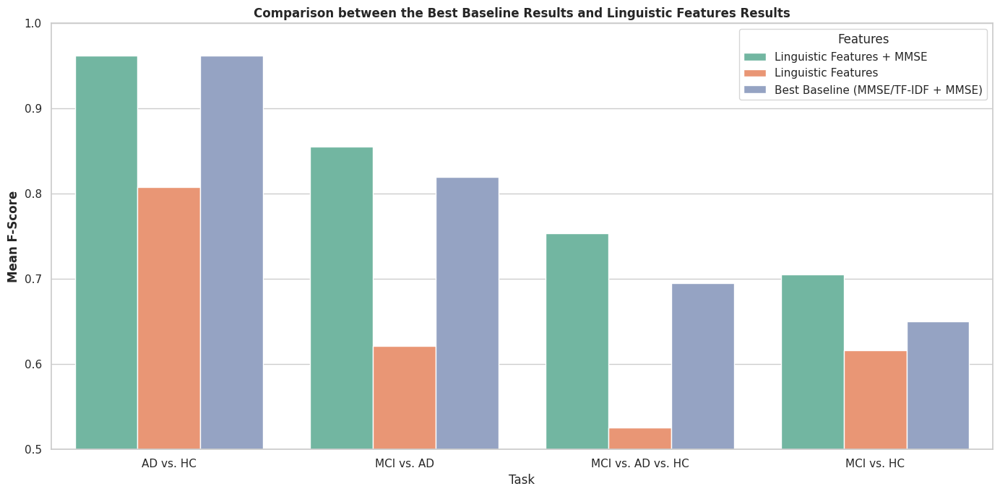

# Automatic Detection of Mild Cognitive Impairment and Alzhemier’s Disease Using Machine Learning

This repository contains code for the Master's Thesis "Automatic Detection of Mild Cognitive Impairment and Alzhemier’s Disease Using Machine Learning" by Kirill Koncha (under Frank Tsiwah and Robert Hartsuiker supervision).

The project consists of different spontenous speech features extractors. The work was conducted with the usage of the [DementiaBank](https://talkbank.org/dementia/) dataset.

# Preparation

**Firstly**, to run this project one need to install the dependencies:

```
pip install -r requirements.txt
```

**Secondly**, to work with this repository you need to have data from DementiaBank.

**Thirdly,** to one needs to take from `Pitt_data.xlsx` (sheet `data`) file ID of each participant and put ID and MMSE scores of participants to separate sheet called `match`. Columns with MMSE scores should be named: `mmse0`, `mmse1`, `mmse2`, etc.

**Fourthly,** to extract *Propositional Idea Density/Efficiency* features, a list of sentences with low specificity should be obtained (for example, with this [method](https://github.com/jjessyli/speciteller)). Each sentence should have separate line and a file should have name `sentences_specificity_filtered.txt` and be put in the `data` folder.

**Finally**, there should be [downloaded](https://fasttext.cc/docs/en/crawl-vectors.html) fastText embeddings for English in the `data` folder.

# Usage

To run this project, one need to have The Cookie Theft Picture descriptions annotations from DementiaBank in the CHAT format.

## Data Preprocessing

To get CSV-file with CoNLL-U annotations, run the following code:

```python3

from src.data_preprocessing.data_preprocessor import DataPreprocessor

dataset_path = "path_to_cookie_theft_annotations"
output_path = "path_to_save_df"
mmse_xlsx_path = "path_to_excel_with_mmse_scores"

process_dataset(dataset_path, output_path, mmse_xlsx_path, reutrn_output=False, match_mmse=True)
```

## Features Extraction

See the `FeaturesExtractor` in `src.features_extraction.features_extractor` for features and their descriptions.

All features are extracted with the respective method:

```python3
import pandas as pd

from src.features_extraction.features_extractor import FeaturesExtractor

df = pd.read_csv("data.csv")

fe = FeaturesExtractor()

df["mlu"] = df["annotation"].apply(fe.extract_mlu)

```

Some of the extraction methods are applied to the `annotation` column (column with CoNLL-U annotations), some features are applied to the `speech` column (column with the transcribed speech). See each function documentation for this information.

*NB:* `extract_sid` and `extract_sid_efficiency` functions require to obtain a list of ICUs. It should be put in the `data` folder. To extract ICUs, use `src.features_extraction.sid_kmeans.kmeans_features`:

```python3
from src.features_extraction.sid_kmeans.kmeans_features import KMeansFeatures

kmeans_features = KMeansFeatures()
vectors = kmeans_features.extract_vectors_for_sid(annotations=df["annotations"].tolist(), reutrn_output=True)

get_clusters(vectors, 23, "path_to_save.csv", save_output=True, reutrn_output=False)
```

To use `extract_pid` and `extract_pid_efficiency` functions, one have to obtain list of low specificity sentences (see the *Preparation* section).

# Statistical Analysis

The table presents statistical comparisons of features distributions among the target groups. To compare distributions of linguistic features and MMSE scores across the target, we use either
one-way ANOVA or Welch’s ANOVA, depending on the homogeneity of variances. All three groups were 
compared pairwise: MCI vs. HC, MCI vs. AD, AD vs. HC. The results are presented after applying either Tukey’s Honest Significant Difference
or Games-Howell post-hoc test (depending on the used ANOVA).

| **Feature**                                   | **Method to Extract**            | **MCI vs. HC** | **MCI vs. AD** | **AD vs. HC** |
|-----------------------------------------------|----------------------------------|----------------|----------------|---------------|
| MMSE                                          | Extracted from DementiaBank      | &lt;           | &gt;           | &lt;          |
| Word-Level MLU                                | `extract_mlu`                    |                | &gt;           | &lt;          |
| Average Stop Words Number                     | `extract_stop_words`             |                |                | &gt;          |
| Average Syntactic Tree Depth                  | `extract_tree_depth`             |                | &gt;           | &lt;          |
| Average Frazier Score                         | `extract_frazier_score`          |                |                |               |
| Average Words per Clause Number               | `extract_words_per_clause`       |                |                |               |
| Average Verbs with Inflections Number         | `extract_verbs_with_inflections` | &gt;           | &lt;           | &gt;          |
| Average Nouns with Determiners Number         | `extract_nouns_with_determiners` |                | &gt;           | &gt;          |
| Average Semantic Idea Density                 | `extract_sid`                    |                |                | &lt;          |
| Average Semantic Idea Efficiency              | `extract_sid_efficiency`         | &lt;           |                | &lt;          |
| Average Propositional Idea Density            | `extract_pid`                    |                |                |               |
| Average Propositional Idea Efficiency         | `extract_pid_efficiency`         | &lt;           |                |               |
| Maas Index                                    | `extract_maas_index`             |                | &lt;           | &gt;          |
| Average Pairwise Sentence Embeddings Distance | `extract_sentence_embeddings`    |                |                | &lt;          |
| Average Surprisal                             | `extract_sentence_surprisal`     | &gt;           |                | &gt;          |
| Average Onomatopoeias Number                  | Extracted from DementiaBank      |                |                |               |
| Average Interjections Number                  | Extracted from DementiaBank      |                | &gt;           | &lt;          |
| Short Pauses Count                            | Extracted from DementiaBank      |                | &lt;           | &gt;          |
| Middle Pauses Count                           | Extracted from DementiaBank      |                |                | &gt;          |
| Long Pauses Count                             | Extracted from DementiaBank      |                |                |               |

# Classifications

The extracted features were used in four classification tasks:
+ AD vs. HC classification
+ MCI vs. AD classification
+ MCI vs. HC classification
+ MCI vs. AD vs. Classification

Classifications were performed via SVM model. Notebooks with classifications could be found in the `/src/classification` folder.

## Baselines

We use two baseline approaches:
+ MMSE scores-based classification
+ MMSE scores + TF-IDF based classifications

The results are presented in the table below:

| **Task**          | **MMSE - F1** | **MMSE - Precision** | **MMSE - Recall** | **TF-IDF+MMSE - F1** | **TF-IDF+MMSE - Precision** | **TF-IDF+MMSE - Recall** |
|-------------------|---------------|----------------------|-------------------|----------------------|-----------------------------|--------------------------|
| AD vs. HC         | 0.955         | 0.955                | 0.960             | **0.962**            | 0.961                       | 0.968                    |
| MCI vs. AD        | **0.820**     | 0.778                | 0.932             | 0.817                | 0.785                       | 0.892                    |
| MCI vs. HC        | 0.617         | 0.666                | 0.641             | **0.650**            | 0.711                       | 0.642                    |
| MCI vs. AD vs. HC | **0.695**     | 0.713                | 0.762             | 0.664                | 0.669                       | 0.674                    |

## Linguistic Features

Linguistic Features were added to MMSE scores and TF-IDF matrices. The combinations of the best features were selected using various methods for each classification task.

| **Task**          | **Mean F1 Macro** | **Mean Precision** | **Mean Recall** | **Features**                                                                       |
|-------------------|-------------------|--------------------|-----------------|------------------------------------------------------------------------------------|
| AD vs. HC         | 0.962             | 0.961              | 0.968           | All Features                                                                       |
| MCI vs. AD        | 0.855             | 0.824              | 0.924           | TF-IDF + MMSE + Average Stop Words Number + Short Pauses Count + Average Surprisal |
| MCI vs. HC        | 0.705             | 0.745              | 0.688           | TF-IDF + MMSE + Average Surprisal                                                  |
| MCI vs. AD vs. HC | 0.754             | 0.760              | 0.773           | TF-IDF + MMSE + Average Interjections Number + Average Surprisal                   |

# Conclusion

In conclusion, MCI prediction performance was increased by adding linguistic features to TF-IDF and MMSE scores.


